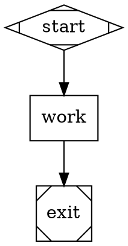
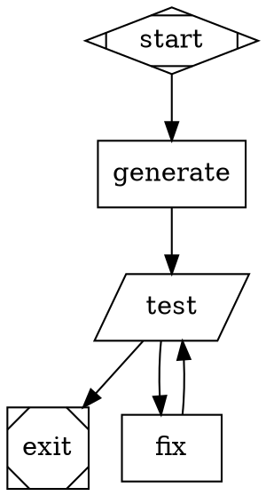
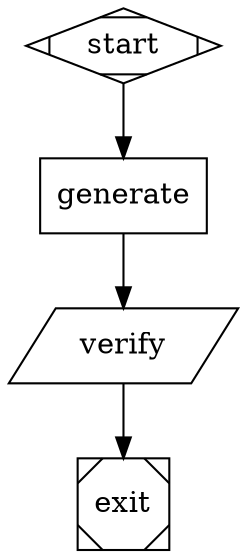

# Pipeline Guidelines

This guide explains how to create pipeline DOT files for `dark-factory` v0.

## Mental model
- A pipeline is a directed graph (`digraph`) of stages.
- Each stage returns an `outcome` (`success`, `fail`, `retry`, `partial_success`).
- Edges can route based on outcome (`condition="outcome=..."`).
- Execution starts at one `start` node and ends at an `exit` node.

Think of it as a small state machine:
- node runs
- outcome is produced
- next edge is chosen
- repeat until exit

## Required structure (v0)
- Exactly one start node:
  - `shape=Mdiamond` or id `start`
- At least one exit node:
  - `shape=Msquare` or id `exit`/`end`
- Every node must be reachable from start.
- Use semicolons after statements.
- Node IDs must match `[A-Za-z_][A-Za-z0-9_]*`.

## Supported node behaviors
- Start:
  - `shape=Mdiamond` (or `type=start`)
- Exit:
  - `shape=Msquare` (or `type=exit`)
- Tool node (shell command):
  - `shape=parallelogram` or `type=tool`
  - requires `tool_command="..."`
- Verification node (deterministic checks from plan):
  - `type=verification` (usually with `shape=parallelogram`)
  - reads plan from context key `verification.plan` by default
  - optional `verification.workdir` to run verification commands from a relative subdirectory
  - requires `verification.allowed_commands="prefix1,prefix2,..."`
- Codergen node (agent-driven):
  - default for `shape=box` (or `type=codergen`)
  - uses `prompt="..."`
  - automatically receives appended runtime failure feedback when prior stage failed (`last_failure.*` context)

## Supported edge conditions
Only these are valid in v0:
- `condition="outcome=success"`
- `condition="outcome=fail"`
- `condition="outcome=retry"`
- `condition="outcome=partial_success"`

If multiple matching edges exist, highest `weight` wins.

## Safety and guardrails
- Always set `allowed_write_paths` on executable nodes (`box`/`parallelogram`) when possible.
- `allowed_write_paths` must be comma-separated relative paths.
- Exact files are allowed by direct entry (example: `main.go`).
- Directories are allowed by trailing slash (example: `src/` allows `src/a.go`, `src/lib/b.go`, etc.).
- Absolute paths and `..` are rejected in `allowed_write_paths`.
- Tool command guardrail rejects:
  - `~`
  - `..`
  - absolute path tokens

Practical implication:
- Parent-directory path escapes are blocked (for example `../secret`), but normal Go patterns like `./...` are allowed.
- Fix-loop scope guard:
  - If previous failed tool stage references script paths outside the fix node `allowed_write_paths`, runtime stops with `unfixable_failure_source`.

## Scenario isolation (recommended)
- If scenario scripts are meant to be holdout validators, do not expose them to agent nodes.
- Codex backend also enforces this by default by hiding `scripts/scenarios/` during agent execution.
- For Codex-backed nodes:
  - set `codex.workdir` to the app directory (example: `agent`)
  - set `codex.add_dirs` only for required read context (example: `examples/specs`)
  - set `codex.strict_read_scope=true` to hard-enforce read scope to workdir + add_dirs
  - keep scenario scripts executed only by tool/verification nodes
- Keep prompts aligned with this policy (avoid "read scenario scripts" instructions).
- Only opt out intentionally:
  - `codex.allow_read_scenarios=true`
  - or custom blocked paths with `codex.block_read_paths`.

Scenario script reliability rules:
- Do not hardcode live provider model ids as script defaults.
- Prefer dynamic model resolution (provider model-list API) with env override support.
- Use per-run temp files (`mktemp`) instead of fixed `/tmp/...` names.
- Emit explicit failure classification for live checks (`failure_class=infra|product`) in the preflight harness.

## Spec separation (recommended)
- Use two spec layers:
  - builder-visible product spec (what to build)
  - orchestration/evaluation docs (how factory validates/routes)
- Builder prompts should reference only product spec paths.
- Avoid including pipeline internals (nodes, routing, layered architecture notes) in builder-visible specs.

Example:
```dot
ensure_codex_wrapper [
  shape=parallelogram,
  type=tool,
  allowed_write_paths=".factory/bin/",
  tool_command="mkdir -p .factory/bin && cp scripts/codex-wrapper.sh .factory/bin/codex && chmod +x .factory/bin/codex"
];

implement [
  shape=box,
  agent.backend="codex",
  codex.path=".factory/bin/codex",
  codex.disable_mcp=true,
  codex.workdir="agent",
  codex.add_dirs="examples/specs",
  codex.strict_read_scope=true,
  allowed_write_paths="agent/",
  prompt="Read ../examples/specs/my_spec.md.\nDo not read scenario scripts.\nUse GOCACHE=\"$PWD/.gocache\" for go commands.\n"
];
```

If `codex.path` is workspace-relative, bootstrap it before agent stages. Otherwise the run fails with missing executable.

## Prompt formatting rules
- Use one quoted string for `prompt`.
- For multi-line prompts, use escaped newlines (`\n`).
- Do not rely on raw multi-line quoted strings.

Example:
```dot
prompt="Line 1\nLine 2\nLine 3\n"
```

## Recommended authoring workflow
1. Start with a minimal linear pipeline.
2. Add a scenario lint gate (`bash scripts/scenarios/lint_scenarios.sh ...`) before runtime validators.
3. Add a fix loop for `outcome=fail`.
4. Add write guardrails (`allowed_write_paths`).
5. Run with fake backend first for deterministic flow checks.
6. Run with real backend once flow and guardrails are stable.

## Template: minimal pipeline


## Template: build/test/fix loop


## Template: codex-backed node (optional)
```dot
generate [
  shape=box,
  agent.backend="codex",
  codex.sandbox="workspace-write",
  codex.approval="never",
  codex.skip_git_repo_check=true,
  allowed_write_paths="main.go,go.mod",
  prompt="Create a minimal Go CLI.\n"
];
```

## Template: verification plan flow


Expected generated verification plan shape:
```json
{
  "files": ["path/to/file.go"],
  "commands": ["go test ./internal/factory"]
}
```

## Common mistakes and fixes
- Mistake: prompt written as raw multiline quote block
  - Symptom: parse error (`invalid syntax`)
  - Fix: use `\n` escaped string

- Mistake: tool command uses `./...`
  - Symptom: `tool_command rejected by guardrail: contains ..`
  - Fix: use `go build .` in v0

- Mistake: broad write scope
  - Symptom: unexpected file mutations
  - Fix: constrain with `allowed_write_paths`; prefer exact files for sensitive paths, directory entries only where needed

- Mistake: verification node has no command allowlist
  - Symptom: verification fails with `verification.allowed_commands is required`
  - Fix: set explicit command prefixes on the verification node

- Mistake: verification plan missing from context
  - Symptom: verification fails with `verification plan missing in context key`
  - Fix: ensure previous node writes `verification_plan` (or `context_updates`) to the configured context key

- Mistake: fix loop drifts away from failing validator
  - Symptom: repeated `... -> fix -> ... -> fix` cycles with same validator error
  - Fix: confirm failed stage artifacts are produced and inspect `fix/prompt.md` for injected `Failure feedback`

- Mistake: no exit path for failures
  - Symptom: routing error (`no route from node ...`)
  - Fix: add explicit fail/retry routing edges

## Validation checklist (before commit)
- DOT parses successfully.
- Graph validation passes (start/exit/reachability).
- Guardrails are defined for executable nodes.
- Test node verifies success criteria.
- Failure path exists and is intentional.
- Run artifacts include expected trace records in `trace.jsonl` for key stages.
- `go test ./...` passes after any runtime changes.
