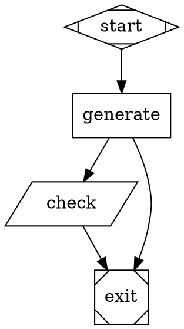

# Dark Factory (Attractor v0)

`dark-factory` is a Go CLI that executes a small pipeline graph described in DOT.

Based on https://github.com/strongdm/attractor/

At a high level, it:
- Parses and validates a `digraph` pipeline.
- Creates an isolated run workspace by copying your source workdir.
- Executes nodes in graph order (with conditional routing and retries).
- Writes run artifacts (`manifest`, `events`, per-node status/output, checkpoints).
- Supports resume from a prior run checkpoint.

## What this repo contains

- `cmd/factory/main.go`: CLI entrypoint.
- `internal/factory/parser.go`: DOT parser.
- `internal/factory/validate.go`: graph validation and guardrails.
- `internal/factory/engine.go`: run engine, handlers, artifacts, resume logic.
- `internal/factory/*_test.go`: unit tests.
- `scripts/smoke.sh`: end-to-end smoke script.

## How to use

## 1) Run tests

```bash
go test ./...
```

## 2) Build the CLI

```bash
go build -o ./bin/factory ./cmd/factory
```

Optional: install as executable `factory`:

```bash
go install ./cmd/factory
```

If `factory` is not found, add Go bin to your PATH (zsh):

```bash
echo 'export PATH="$PATH:$(go env GOPATH)/bin"' >> ~/.zshrc
source ~/.zshrc
```

Verify:

```bash
which factory
factory run --help
```

## 3) Create a pipeline file

Example `pipeline.dot`:



## 4) Run a pipeline

```bash
./bin/factory run --workdir . --runsdir ./runs --run-id demo pipeline.dot
```

Required flags:
- `--workdir`: source directory copied into the run workspace.
- `--runsdir`: parent directory where run artifacts are stored.

Optional flags:
- `--run-id`: explicit run id (otherwise current UTC timestamp is used).
- `--resume`: resume an existing run (requires `--run-id`).

## 5) Inspect outputs

For run id `demo`, artifacts are in `runs/demo/`:
- `manifest.json`: run metadata.
- `events.jsonl`: pipeline/stage lifecycle events.
- `trace.jsonl`: structured per-session trace (inputs, outputs, context transforms, route decisions).
- `checkpoint.json`: resume state.
- `<node-id>/status.json`: node outcome.
- `<node-id>/prompt.md`, `response.md`: codergen node inputs/outputs.
- `<node-id>/tool.stdout.txt`, `tool.stderr.txt`, `tool.exitcode.txt`: tool node command output.
- `<node-id>/workspace.diff.json`: file changes made during node execution.
- `workspace/`: copied workdir used for this run.

## Node behavior summary

Node handler selection:
- `shape=Mdiamond` or `type=start` -> start handler.
- `shape=Msquare` or `type=exit` -> exit handler.
- `shape=parallelogram` or `type=tool` -> tool handler.
- `type=verification` -> verification handler (deterministic plan-driven checks).
- default (`shape=box` / unspecified type) -> codergen handler.

`allowed_write_paths` supports:
- exact file entries (example: `main.go`)
- directory entries with trailing slash (example: `src/`)

Supported edge conditions:
- `outcome=success`
- `outcome=fail`
- `outcome=retry`
- `outcome=partial_success`

If multiple matching edges exist, highest `weight` wins.

## Fake backend mode (useful for tests)

Set `ATTRACTION_BACKEND=fake` (or `ATTRACTOR_BACKEND=fake`) to make `codergen` nodes return deterministic outcomes from test attrs (for example `test.outcome`, `test.outcome_sequence`).

Example:

```bash
ATTRACTION_BACKEND=fake ./bin/factory run pipeline.dot --workdir . --runsdir ./runs --run-id fake-demo
```

## Codex backend (real agent execution)

`codergen` nodes can run through a pluggable agent interface. The built-in real backend is `codex`.

Enable it:

```bash
ATTRACTOR_AGENT_BACKEND=codex ./bin/factory run --workdir . --runsdir ./runs --run-id codex-demo pipeline.dot
```

You can configure Codex at node level (`codex.*` attrs) or via env vars:

- Sandbox:
  - attr: `codex.sandbox`
  - env: `ATTRACTOR_CODEX_SANDBOX`
- Approval policy:
  - attr: `codex.approval`
  - env: `ATTRACTOR_CODEX_APPROVAL`
- Working directory:
  - attr: `codex.workdir` (relative to run workspace, or absolute)
  - env: `ATTRACTOR_CODEX_WORKDIR`
- Additional writable directories:
  - attr: `codex.add_dirs` (CSV)
  - env: `ATTRACTOR_CODEX_ADD_DIRS` (CSV)
- Auto-approved command list via config override key:
  - attr: `codex.auto_approve_commands` (CSV)
  - attr: `codex.auto_approve_config_key` (target Codex config key)
  - env: `ATTRACTOR_CODEX_AUTO_APPROVE_COMMANDS`, `ATTRACTOR_CODEX_AUTO_APPROVE_CONFIG_KEY`
- Raw Codex config overrides:
  - attr: `codex.config_overrides` (`;;`-separated `key=value` entries)
  - env: `ATTRACTOR_CODEX_CONFIG_OVERRIDES`
- Optional model/profile:
  - attr: `codex.model`, `codex.profile`
  - env: `ATTRACTOR_CODEX_MODEL`, `ATTRACTOR_CODEX_PROFILE`
- Optional timeout/heartbeat:
  - attr: `codex.timeout_seconds`, `codex.heartbeat_seconds`
  - env: `ATTRACTOR_CODEX_TIMEOUT_SECONDS`, `ATTRACTOR_CODEX_HEARTBEAT_SECONDS`

Runtime logging controls:
- `FACTORY_LOG_LEVEL=debug|info|warn|error`
- `FACTORY_LOG_FORMAT=text|json`
- `FACTORY_LOG_CODEX_STREAM=1` (optional live stdout/stderr stream lines)

Codex outputs and schema are written per node:
- `<node>/codex.output.schema.json`
- `<node>/codex.args.txt`
- `<node>/codex.stdout.log`
- `<node>/codex.stderr.log`
- `<node>/response.md` (JSON response mapped to stage outcome)

Notes:
- `codex.stdout.log` and `codex.stderr.log` are written incrementally while the node runs.
- If `--runsdir` is under `--workdir` (for example `--runsdir ./.runs`), factory excludes that nested path from workspace copy to avoid recursive copy loops.
- The generated agent CLI in examples reads API keys from process environment (`os.Getenv`) and does not auto-load `.env`.

Codex can also return an optional `verification_plan` object. The engine stores it in context (default key `verification.plan`) so a later `type=verification` node can execute deterministic checks from that plan.

## Smoke script

Run the included smoke test:

```bash
bash scripts/smoke.sh
```
